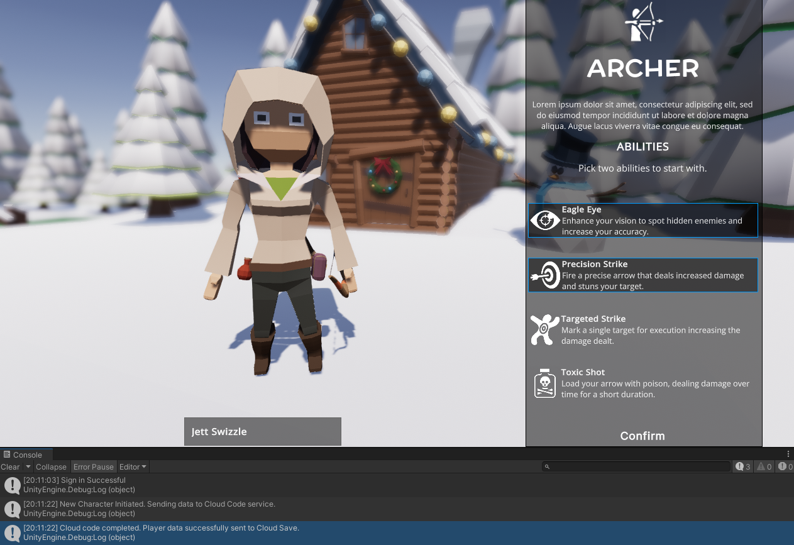

> View the entire tutorial on [GameDev Resources](https://www.gamedev-resources.com).

# Improve retention and prevent cheating by storing player data in the cloud
Storing player and save data in a cloud service is a simple and effective way to enhance player retention in your game. By allowing players to access their progress from any device and protecting their data from loss in the event of an uninstall or device reset, you can provide a seamless and uninterrupted gaming experience, ultimately keeping players engaged and coming back for more. Having access to the data also lets you test updates and patches on real world data - reducing the likelihood of introducing breaking changes.

In this tutorial you will learn how to read, write, and validate player data using the free tier of Unity Gaming Service's Cloud Code and Cloud Save products.

# Learning Outcomes
* Create a new cloud project with Unity Gaming Services
* Use UGS antonymous authentication
* Read and write data directly to Cloud Save
* Setup a Cloud Code script with custom parameters
* Use Cloud Code to store player data in Cloud Save

# Prerequisites
* You will need Unity 2022.2 or later to follow along. (This tutorial may work with older versions, but is not gauranteed.) 
* This tutorial assumes you already have intermediate knowledge of Unity, C# and JavaScript.
